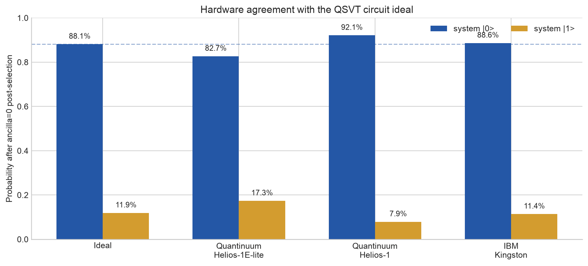
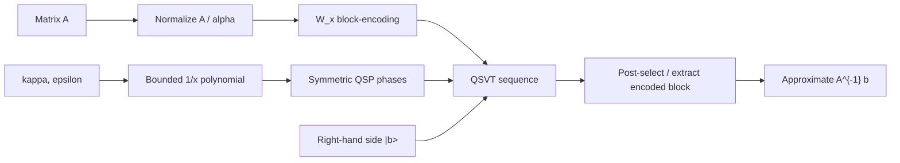

# QSVT Linear Solvers

[](https://github.com/MonitSharma/qsvt-linear-solvers/actions/workflows/ci.yml)
[](LICENSE)

This repository implements and validates a quantum linear-system solver based on
**Quantum Singular Value Transformation (QSVT)**.  The project starts from the
fault-tolerant algorithmic primitives, verifies them against dense classical
linear algebra, compares the resulting solver with a faithful HHL baseline, and
then runs the same shallow two-qubit QSVT circuit on two production quantum
hardware stacks:

- **Quantinuum Nexus / Helios**: `Helios-1SC`, `Helios-1E-lite`, and `Helios-1`.
- **IBM Quantum Runtime**: `ibm_kingston` through Qiskit Runtime Sampler V2.

The central result is that the device experiments reproduce the expected
post-selected QSVT circuit distribution.  The noiseless target for the hardware
circuit is **88.1% / 11.9%** on the system qubit after selecting the
block-encoding ancilla in `|0>`.  The measured post-selected distributions were
**82.7% / 17.3%** on the Quantinuum noisy emulator, **92.1% / 7.9%** on
Quantinuum Helios-1 hardware, and **88.6% / 11.4%** on IBM Kingston hardware.



## Abstract

Solving linear systems `Ax = b` is a computational kernel across scientific
computing, engineering simulation, optimization, and machine learning.  QSVT
provides a modern alternative to phase-estimation based linear solvers: instead
of estimating eigenvalues and rotating an ancilla as in HHL, QSVT directly
applies a bounded polynomial approximation to `1/x` to a block-encoding of `A`.
This project implements that pipeline end to end:

1. Construct a block-encoding of a Hermitian contraction `A`.
2. Generate a bounded Chebyshev approximation `P(x) ~= scale / x`.
3. Use symmetric QSP phase finding to realize `P` as a QSVT sequence.
4. Apply the encoded matrix function to `|b>`.
5. Compare against NumPy and HHL in classical simulation.
6. Compile and execute a minimal hardware instance on Quantinuum and IBM
   quantum processors.

The implementation is intentionally research-oriented: the primitives are kept
small enough to audit, the solver is verified numerically, and the hardware
paths preserve the same circuit semantics so that emulator and QPU results can
be compared to a single noiseless target.

## What Was Achieved

| Layer | Achievement | Evidence |
|---|---:|---|
| Block encoding | Verified `W_x(A)` unitary dilation and encoded block recovery | Unit tests at `1e-9` tolerance |
| QSP/QSVT | Verified phase factors and QSVT block operator `P(A)` | Unit tests at `1e-6` to `1e-13` tolerance |
| Classical linear solve | QSVT recovers `numpy.linalg.solve` on Hermitian, indefinite, and non-Hermitian systems | `pytest` solver suite |
| HHL comparison | Faithful statevector HHL baseline implemented for real SPD systems | QPE-resolution benchmark |
| Quantinuum emulator | QSVT circuit executed on `Helios-1E-lite` noisy emulator | 100-shot Qsys result |
| Quantinuum hardware | QSVT circuit executed on real `Helios-1` hardware | 500-shot Qsys result, 49.61 HQC |
| IBM hardware | QSVT circuit executed on `ibm_kingston` | 1024-shot Runtime Sampler V2 result |

## Algorithm

For a normalized Hermitian matrix `A_n = A / alpha`, the solver constructs a
bounded odd polynomial

```text
P(x) ~= scale / x        for |x| in [1/kappa, 1].
```

Given a block-encoding `U_A` of `A_n`, QSVT transforms the encoded block from
`A_n` into `P(A_n)`.  Applying this to the normalized right-hand side gives

```text
P(A_n) |b> ~= scale * A_n^{-1} |b>.
```

The classical solution is recovered by undoing the normalization:

```text
x ~= P(A_n) b / (scale * alpha).
```

The project uses the `W_x` signal convention:

```text
W(x) = [[x, i sqrt(1 - x^2)],
        [i sqrt(1 - x^2), x]]

S(phi) = exp(i phi Z)
U_Phi(x) = S(phi_0) prod_k W(x) S(phi_k)
```

The symmetric-QSP phase convention realizes the target polynomial as
`Im <0|U_Phi(x)|0> = P(x)`.  For the dense statevector solver, the imaginary
component is extracted exactly by the local QSVT block-operator construction.
For the current hardware demonstration, the device circuit runs the direct
`Q_Phi` sequence and post-selects the block-encoding ancilla.  That is why the
hardware target is the circuit ideal **88.1% / 11.9%**, while the full solver's
imaginary-part extraction is the step that recovers the textbook 90/10 solution
direction.



## Repository Layout

```text
primitives/
  block_encoding.py          # unitary dilation + LCU block encodings
  qsp_qsvt.py                # 1/x polynomial, QSP angles, QSVT matrix function
  amplitude_amplification.py # Grover and fixed-point amplification utilities
solvers/
  qsvt_linear_solver.py      # QSVT linear solver for Ax=b
  hhl_baseline.py            # faithful QPE-based HHL baseline
hardware/
  quantinuum_runner.py       # pytket -> HUGR -> Nexus / Helios execution
  run_ibm.py                 # Qiskit -> IBM Runtime Sampler V2 execution
  ibm_results/               # persisted IBM Runtime job records
docs/
  generate_readme_figures.py # reproducible README plots
  figures/                   # generated PNG figures
  results/readme_results.json
tests/                       # primitive, solver, and hardware-circuit tests
```

## Classical Simulation Results

The core solver is first validated without hardware noise.  On a 4x4 symmetric
positive-definite benchmark, QSVT is compared against a faithful HHL baseline
that models quantum phase estimation through the exact Dirichlet kernel.

| Solver | Configuration | Relative residual `||Ax-b||/||b||` | Relative solution error | Success probability |
|---|---:|---:|---:|---:|
| QSVT | `epsilon=0.01`, degree 549 | `4.76e-05` | `6.77e-05` | `0.105` |
| HHL | 9 clock qubits | `4.39e-04` | `3.45e-04` | `0.677` |

The QSVT sweep shows smooth improvement as the reciprocal polynomial is refined.
The HHL curve improves with more phase-estimation resolution, but can move
non-monotonically at small register sizes because the eigenvalues sit on a
finite QPE grid.


For the sweep plotted above:

| QSVT epsilon | Degree | Residual |
|---:|---:|---:|
| `0.300` | 145 | `4.05e-03` |
| `0.100` | 203 | `6.06e-04` |
| `0.030` | 265 | `8.36e-05` |
| `0.010` | 323 | `1.38e-05` |
| `0.003` | 385 | `2.13e-06` |

| HHL clock qubits | Residual |
|---:|---:|
| 4 | `1.41e-02` |
| 5 | `3.74e-03` |
| 6 | `4.66e-03` |
| 7 | `3.94e-04` |
| 8 | `9.73e-04` |
| 9 | `5.50e-04` |

## Hardware Demonstration

The hardware problem is a deliberately small, auditable 2x2 system:

```text
A = [[0.75, 0.25],
     [0.25, 0.75]],       b = |0>
```

The exact linear-system solution direction is approximately
`[0.9487, -0.3162]`, corresponding to a 90/10 system-qubit probability split.
The device circuit runs the direct `Q_Phi` sequence, whose noiseless post-selected
target is:

| Quantity | Value |
|---|---:|
| Raw system probability `P(0), P(1)` | `85.7%`, `14.3%` |
| Ancilla success probability `P(ancilla=0)` | `93.6%` |
| Post-selected system probability given `ancilla=0` | `88.1%`, `11.9%` |

The measured hardware and emulator results below use the same convention for
joint bitstrings: **`system,ancilla`**.  Therefore the post-selected branch is
formed from keys ending in `0`: `00` and `10`.


### Quantinuum Results

The Quantinuum path lowers the pytket circuit to a no-input HUGR `main()` and
executes it through Nexus.

| Stage | Backend | Job ID | Shots | Status | Notes |
|---|---|---|---:|---|---|
| Syntax check | `Helios-1SC` | `2ae0ce01-bf67-4747-9379-afed24760fb6` | 100 | Completed | Program validation, no shot results |
| Noisy emulator | `Helios-1E-lite` / SelenePlus | `65245a1e-20b6-49f3-8265-787684c59298` | 100 | Completed | QSystem-style noisy emulation |
| Hardware | `Helios-1` | `02e36ce1-cf5b-4510-8f7f-6d9afac3c8bb` | 500 | Completed | Real hardware, 49.61 HQC |

Quantinuum emulator joint counts:

| Bitstring `system,ancilla` | Count | Fraction |
|---|---:|---:|
| `00` | 81 | `81.0%` |
| `10` | 17 | `17.0%` |
| `01` | 1 | `1.0%` |
| `11` | 1 | `1.0%` |

Post-selecting `ancilla=0` gives `81/(81+17) = 82.7%` on system `0` and
`17.3%` on system `1`.

Quantinuum Helios-1 hardware joint counts:

| Bitstring `system,ancilla` | Count | Fraction |
|---|---:|---:|
| `00` | 432 | `86.4%` |
| `10` | 37 | `7.4%` |
| `01` | 17 | `3.4%` |
| `11` | 14 | `2.8%` |

Post-selecting `ancilla=0` gives `432/(432+37) = 92.1%` on system `0` and
`7.9%` on system `1`.

### IBM Quantum Results

The IBM path builds the same two-qubit QSVT circuit in Qiskit, conjugates the
block-encoding into Qiskit's little-endian qubit ordering, transpiles for the
selected backend, and submits through Qiskit Runtime Sampler V2.

| Backend | Job ID | Shots | Status |
|---|---|---:|---|
| `ibm_kingston` | `d8r3pvekodhs7383v6ag` | 1024 | Completed |

IBM Kingston joint counts:

| Bitstring `system,ancilla` | Count | Fraction |
|---|---:|---:|
| `00` | 841 | `82.1%` |
| `10` | 108 | `10.5%` |
| `01` | 28 | `2.7%` |
| `11` | 47 | `4.6%` |

Post-selecting `ancilla=0` gives `841/(841+108) = 88.6%` on system `0` and
`11.4%` on system `1`, closely matching the noiseless circuit ideal
`88.1% / 11.9%`.

## Hardware Summary

| Execution | Shots | Ancilla success | Post-selected `P(system=0)` | Post-selected `P(system=1)` | Delta from ideal on `P(system=0)` |
|---|---:|---:|---:|---:|---:|
| Noiseless circuit ideal | statevector | `93.6%` | `88.1%` | `11.9%` | `0.0 pp` |
| Quantinuum Helios-1E-lite | 100 | `98.0%` | `82.7%` | `17.3%` | `-5.5 pp` |
| Quantinuum Helios-1 | 500 | `93.8%` | `92.1%` | `7.9%` | `+4.0 pp` |
| IBM Kingston | 1024 | `92.7%` | `88.6%` | `11.4%` | `+0.5 pp` |

The IBM run is the closest match to the noiseless QSVT circuit distribution in
this shot regime.  The Quantinuum Helios-1 hardware run is also consistent with
the target within the expected scale of finite-shot and device noise; its
measured ancilla success probability, `93.8%`, is nearly identical to the
statevector ideal, `93.6%`.

## Engineering Notes

- The solver supports Hermitian systems directly and non-Hermitian systems by
  Hermitian dilation.
- The hardware runners are deliberately separate because Quantinuum and IBM use
  different compilation/runtime models: HUGR through Nexus for Helios, and
  Qiskit Runtime Sampler V2 for IBM.
- Tests include an explicit endian-regression check for the IBM circuit.  This
  matters because the local QSVT matrix code and pytket use an
  `ancilla,system` interpretation, while Qiskit count keys display
  `system,ancilla` for this two-qubit layout.
- The hardware files do not store credentials.  IBM credentials are read from
  `IBM_QUANTUM_TOKEN` and `IBM_QUANTUM_CRN`; Quantinuum authentication is handled
  through the user's Nexus login.

## Reproducing the Project

Create an environment and run the full test suite:

```bash
python -m venv .venv
source .venv/bin/activate
pip install -r requirements.txt
pytest -q
```

Regenerate the figures and summary JSON:

```bash
python docs/generate_readme_figures.py
```

Run the QSVT solver from Python:

```python
import numpy as np
from solvers.qsvt_linear_solver import solve

A = np.array([[2.0, 0.5], [0.5, 1.5]])
b = np.array([1.0, 2.0])

res = solve(A, b, epsilon=1e-2)
print(res.x)
print(res.residual)
print(res.degree, res.kappa)
print(res.success_probability)
```

Run the IBM hardware path:

```bash
export IBM_QUANTUM_TOKEN="..."
export IBM_QUANTUM_CRN="crn:v1:..."

python -m hardware.run_ibm ideal --matrix-check
python -m hardware.run_ibm list-backends
python -m hardware.run_ibm submit --backend ibm_kingston --shots 1024
python -m hardware.run_ibm status --job-id <job-id> --wait
```

Run the Quantinuum path after Nexus login:

```python
import qnexus
qnexus.login()

from hardware.quantinuum_runner import _demo

runner, hw = _demo()
runner.hardware_status(hw)
runner.wait(hw)
```

## Status

The core numerical solver, HHL baseline, QSVT primitive tests, Quantinuum runner,
IBM runner, result extraction, and README figures are complete.  Natural next
extensions are larger structured systems, sparse block-encoding strategies,
explicit imaginary-part hardware extraction, and application-level PDE examples
in `applications/`.

## License

MIT.  See [LICENSE](LICENSE).
