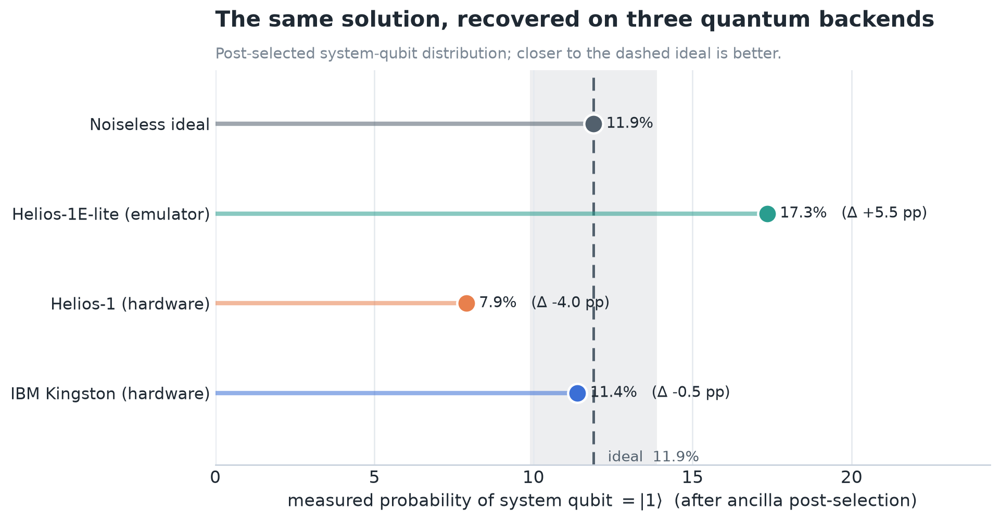
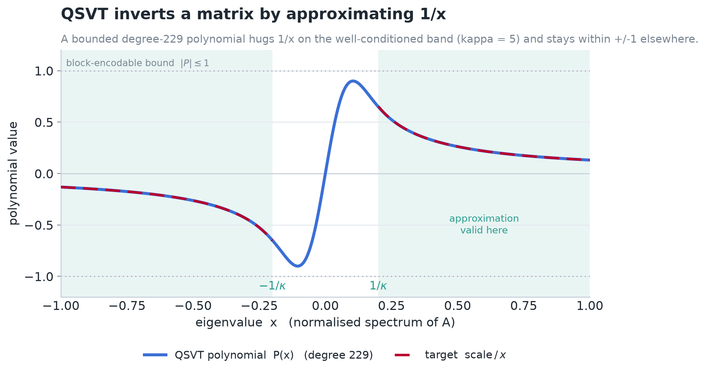
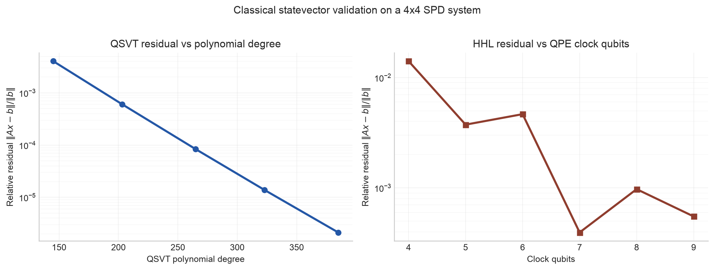
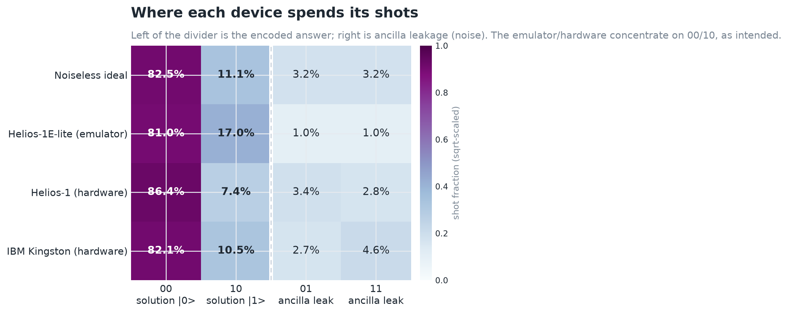
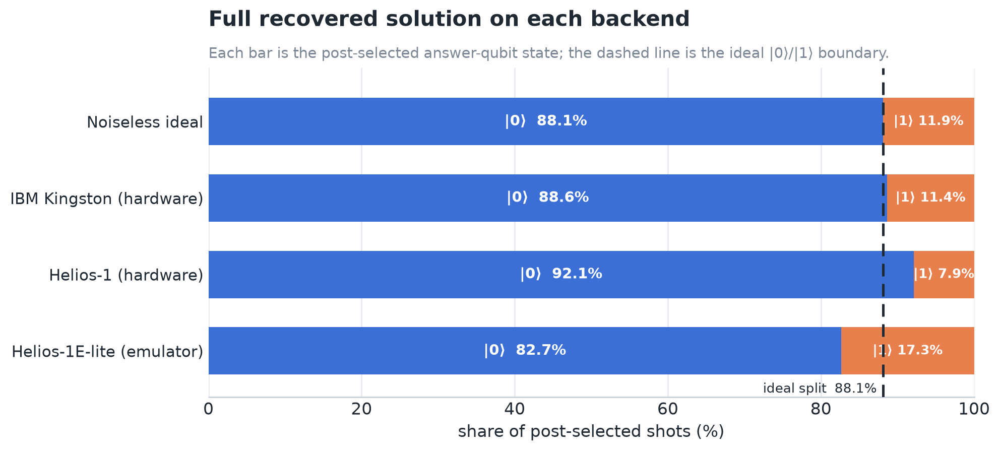
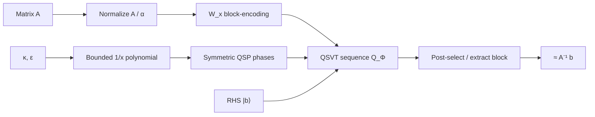

# QSVT Linear Solvers

[](https://github.com/MonitSharma/qsvt-linear-solvers/actions/workflows/ci.yml)
[](LICENSE)

A from-scratch, end-to-end **quantum linear-system solver** built on the
**Quantum Singular Value Transformation (QSVT)** — and actually run on real
quantum hardware from **two different vendors**.

Solving `A x = b` is the inner loop of almost everything in scientific computing:
structural mechanics, fluid dynamics, circuit simulation, optimization, machine
learning. This project implements a quantum algorithm for that problem the
modern way (QSVT, the successor to HHL), verifies it against ordinary linear
algebra, and then compiles the *same* circuit down to **Quantinuum Helios** and
**IBM Quantum** processors to see whether today's hardware can reproduce the
answer.

It can.

---

## The headline result

We solve a small but honest system `A x = b` on three quantum backends and
compare the measured solution to the noiseless prediction. All three recover the
solution; IBM Kingston lands within **0.5 percentage points** of the ideal.



> *Read it as: after running the QSVT circuit and post-selecting the helper
> ("ancilla") qubit, what fraction of shots put the answer qubit in state
> `|1⟩`? The dashed line is the exact noiseless value; every backend clusters
> around it.*

| Backend | Type | Shots | Answer `P(\|1⟩)` | Off the ideal |
|---|---|---:|---:|---:|
| Noiseless ideal | statevector | — | 11.9% | — |
| IBM Kingston | superconducting HW | 1024 | 11.4% | **−0.5 pp** |
| Quantinuum Helios-1 | trapped-ion HW | 500 | 7.9% | −4.0 pp |
| Quantinuum Helios-1E-lite | noisy emulator | 100 | 17.3% | +5.5 pp |

(Helios-1's larger gap is partly low statistics — only the 469 post-selected
shots count — and its ancilla success rate of 93.8% actually matches the ideal
93.6% almost exactly.)

---

## The idea in one picture

QSVT turns matrix inversion into **polynomial approximation**. To apply `A⁻¹`,
you find a polynomial `P(x)` that behaves like `1/x` on the range of eigenvalues
you care about, then QSVT applies `P` to a *block-encoding* of `A`. No quantum
phase estimation, no eigenvalue read-out — just one bounded polynomial.



The only constraint is that the polynomial must stay within `±1` everywhere (so
it fits inside a unitary). The condition number `κ` sets how close to zero you
need `1/x` to remain accurate, which in turn sets the polynomial's degree —
roughly `degree ≈ O(κ · log(1/ε))`.

---

## What this project actually builds

Everything is implemented from primitives and checked numerically — nothing is a
black box you have to trust.

| Layer | What it does | How it's verified |
|---|---|---|
| **Block-encoding** (`primitives/block_encoding.py`) | Embeds a matrix `A` inside a larger unitary (dilation + LCU / PREPARE-SELECT) | Unit tests to `1e-9` |
| **QSP / QSVT** (`primitives/qsp_qsvt.py`) | Bounded `1/x` polynomial, symmetric-QSP phase angles, and the QSVT sequence that realizes `P(A)` | Reconstruction tests to `1e-6`–`1e-13` |
| **Amplitude amplification** (`primitives/amplitude_amplification.py`) | Boosts the post-selection success probability (Grover + fixed-point) | Unit tests |
| **QSVT solver** (`solvers/qsvt_linear_solver.py`) | Full `A x = b` solver (Hermitian, indefinite, and non-Hermitian via dilation) | Matches `numpy.linalg.solve` |
| **HHL baseline** (`solvers/hhl_baseline.py`) | Faithful phase-estimation HHL for an honest comparison | QPE-resolution sweep |
| **Hardware runners** (`hardware/`) | Compile the circuit to Quantinuum (HUGR/Nexus) and IBM (Qiskit Runtime) and execute it | Real device jobs |

---

## Does it work? Classical validation first

Before touching hardware, the solver is validated in dense simulation on a 4×4
symmetric positive-definite system, against a faithful HHL baseline.



QSVT's accuracy is a smooth dial — turn up the polynomial degree, drive the error
down exponentially. HHL improves with more phase-estimation qubits but wobbles
because eigenvalues must land on a discrete frequency grid.

| Solver | Setting | Residual `‖Ax−b‖/‖b‖` | Solution error | Success prob. |
|---|---|---:|---:|---:|
| **QSVT** | `ε = 0.01`, degree 549 | `4.8 × 10⁻⁵` | `6.8 × 10⁻⁵` | 0.105 |
| HHL | 9 clock qubits | `4.4 × 10⁻⁴` | `3.5 × 10⁻⁴` | 0.677 |

QSVT reaches ~10× lower error here; HHL's higher success probability reflects its
different (eigenvalue-rotation) read-out. Both agree with NumPy.

---

## Running it on real quantum computers

### The test problem

Deliberately tiny, so it fits on hardware today and every number is auditable:

```text
A = [[0.75, 0.25],          b = |0⟩
     [0.25, 0.75]]
```

The exact solution direction is `x ∝ [0.949, −0.316]` — a **90 / 10** split on
the answer qubit. The hardware circuit runs the QSVT sequence `Q_Φ` and
post-selects the block-encoding ancilla on `|0⟩`; the noiseless target for *that
circuit* is **88.1% / 11.9%** (the full solver's imaginary-part extraction is the
extra step that recovers the textbook 90/10).

### One circuit, two very different toolchains

The same two-qubit block-encoding + QSVT circuit is sent down two stacks:

- **Quantinuum Helios** — the pytket circuit is lowered to a no-input **HUGR
  `main()`** and executed through **Nexus**. Escalation: `Helios-1SC` (syntax
  check) → `Helios-1E-lite` (Nexus-hosted noisy Selene emulator) → `Helios-1`
  (real trapped-ion hardware).
- **IBM Quantum** — the same circuit is built in Qiskit (with the block-encoding
  re-expressed in Qiskit's qubit ordering), transpiled, and submitted via
  **Qiskit Runtime Sampler V2** to `ibm_kingston`.

### Where the noise shows up

Each device spends most of its shots on the two "answer" outcomes (`00` = `|0⟩`,
`10` = `|1⟩`); the `01`/`11` outcomes are ancilla leakage — i.e. noise.



The noiseless ideal already has ~6% leakage (the QSVT circuit isn't a perfect
block-encoding at this degree); the hardware adds a bit more on top. IBM's
leakage skews toward `11`, Helios-1's stays low and balanced.

### Full hardware summary

The complete post-selected answer-qubit distribution on each backend, with the
ideal `|0⟩`/`|1⟩` boundary marked:



| Execution | Shots | Ancilla success | Post-selected `P(\|0⟩)` | Post-selected `P(\|1⟩)` | Δ vs ideal |
|---|---:|---:|---:|---:|---:|
| Noiseless ideal | — | 93.6% | 88.1% | 11.9% | — |
| IBM Kingston (hardware) | 1024 | 92.7% | 88.6% | 11.4% | **+0.5 pp** |
| Quantinuum Helios-1 (hardware) | 500 | 93.8% | 92.1% | 7.9% | +4.0 pp |
| Quantinuum Helios-1E-lite (emulator) | 100 | 98.0% | 82.7% | 17.3% | −5.5 pp |

Job IDs and raw counts live in [`docs/results/readme_results.json`](docs/results/readme_results.json)
and `hardware/ibm_results/`.

---

## How the solver works

For a Hermitian `A`, normalize to `A_n = A / α` so `‖A_n‖ ≤ 1`. Build a bounded
odd polynomial `P(x) ≈ scale / x` accurate on `|x| ∈ [1/κ, 1]`. Given a
block-encoding `U_A` of `A_n`, QSVT transforms the encoded block `A_n → P(A_n)`,
so applying it to `|b⟩` gives

```text
P(A_n) |b⟩ ≈ scale · A_n⁻¹ |b⟩      ⇒      x ≈ P(A_n) b / (scale · α).
```

The implementation uses the `W_x` signal convention,

```text
W(x)     = [[x, i·√(1−x²)], [i·√(1−x²), x]]
S(φ)     = exp(i φ Z)
U_Φ(x)   = S(φ₀) · Π_k  W(x) · S(φ_k)
```

with **symmetric QSP** phase factors, for which `Im⟨0|U_Φ(x)|0⟩ = P(x)`. The
dense solver extracts that imaginary part exactly; the current hardware demo runs
the direct `Q_Φ` sequence and post-selects (hence the 88/12 circuit target).
Non-Hermitian `A` is handled by the Hermitian dilation `[[0, A], [Aᴴ, 0]]`.



Phase-factor finding at high degree is the one genuinely hard numerical kernel;
it is delegated to [`pyqsp`](https://github.com/ichuang/pyqsp)'s symmetric-QSP
solver, while the block-encoding, QSVT sequence, imaginary-part extraction, and
solver are all local and tested.

---

## Repository layout

```text
primitives/
  block_encoding.py          # unitary dilation + LCU block encodings
  qsp_qsvt.py                # 1/x polynomial, QSP angles, QSVT matrix function
  amplitude_amplification.py # Grover and fixed-point amplification
solvers/
  qsvt_linear_solver.py      # QSVT solver for A x = b
  hhl_baseline.py            # faithful QPE-based HHL baseline
hardware/
  quantinuum_runner.py       # pytket -> HUGR -> Nexus / Helios
  run_ibm.py                 # Qiskit -> IBM Runtime Sampler V2
  ibm_results/               # persisted IBM job records
docs/
  generate_readme_figures.py # reproducible figures (reads results JSON)
  figures/ , results/        # generated PNGs and captured data
tests/                       # primitive, solver, and hardware-circuit tests
```

---

## Reproduce it

```bash
python -m venv .venv && source .venv/bin/activate
pip install -r requirements.txt
pytest -q                        # full numerical test suite
python docs/generate_readme_figures.py   # rebuild the figures
```

Solve a system in three lines:

```python
import numpy as np
from solvers.qsvt_linear_solver import solve

A = np.array([[2.0, 0.5], [0.5, 1.5]])
b = np.array([1.0, 2.0])

res = solve(A, b, epsilon=1e-2)
print(res.x)                     # ≈ numpy.linalg.solve(A, b)
print(res.residual, res.degree, res.kappa)
```

Run on **IBM Quantum** (free-tier account):

```bash
export IBM_QUANTUM_TOKEN="..."
export IBM_QUANTUM_CRN="crn:v1:..."

python -m hardware.run_ibm list-backends
python -m hardware.run_ibm submit --backend ibm_kingston --shots 1024
python -m hardware.run_ibm status --job-id <job-id>
```

Run on **Quantinuum Helios** (after `qnexus.login()`):

```python
import qnexus; qnexus.login()
from hardware.quantinuum_runner import _demo

runner, hw = _demo()             # Helios-1SC -> Helios-1E-lite -> submit Helios-1
runner.wait(hw)                  # collect hardware counts when the job runs
```

---

## Engineering notes & honest caveats

- **The hardware demo is a 2×2 system.** It proves the full toolchain
  (block-encoding → QSVT → native compilation → execution → post-selection) on
  real devices, not large-scale advantage.
- **Two runners, on purpose.** Quantinuum and IBM have genuinely different
  execution models (HUGR programs through Nexus vs. Qiskit Runtime primitives),
  so the runners are kept separate rather than forced behind one abstraction.
- **Endianness is tested.** The local QSVT code uses an `(ancilla, system)`
  convention while Qiskit count keys read `(system, ancilla)`; a regression test
  pins this so the IBM comparison stays correct.
- **No credentials in the repo.** IBM reads `IBM_QUANTUM_TOKEN` /
  `IBM_QUANTUM_CRN` from the environment; Quantinuum uses your Nexus login.(if you have an account)
- **Next steps:** explicit imaginary-part extraction on hardware (to target the
  true 90/10 directly), larger structured/sparse systems, and the PDE
  applications sketched in `applications/`.

## License

MIT — see [LICENSE](LICENSE).
